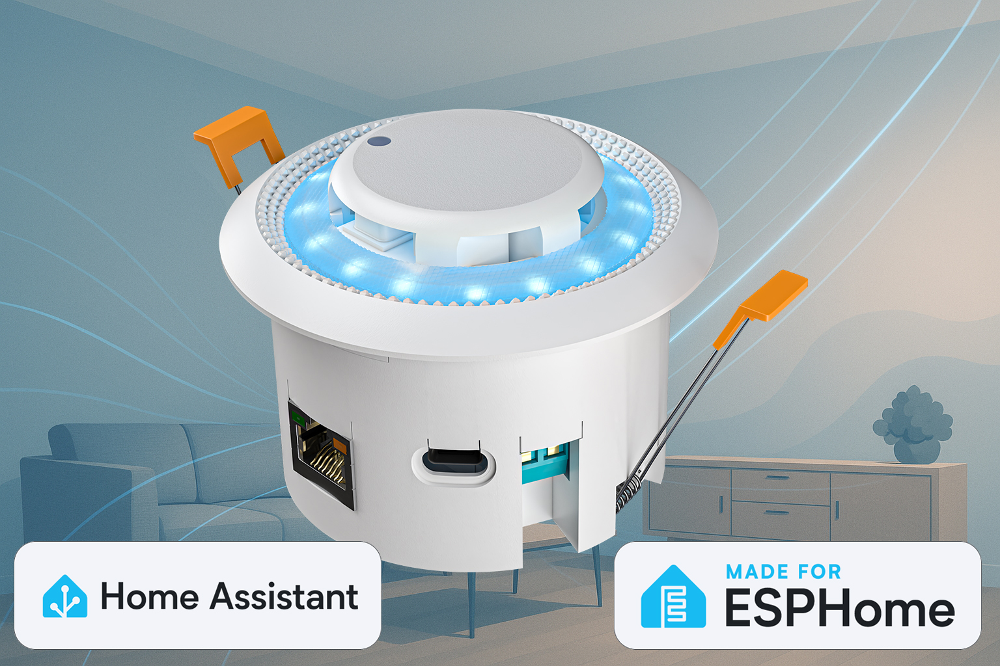

# CeilSense for Home Assistant / ESPHome

CeilSense is a ceiling‑mounted, all‑in‑one room sensor designed to deliver reliable presence, air‑quality and ambient measurements. It integrates seamlessly with Home Assistant via ESPHome and runs fully local (no cloud required).

Learn more on our website: https://ceilsense.nl/en

## Key features

- **Presence sensing (radar)**: Accurate motion/still detection with default included LD2412 mmwave module.
- **Air quality**: CO₂, temperature, humidity (SCD41).
- **Ambient**: Illuminance (BH1750), pressure/altitude (BMP3xx).
- **Connectivity**: Wi‑Fi or Ethernet with included PoE variants.
- **Provisioning**: Improv over BLE/Serial and captive portal (Wi‑Fi builds).
- **Local only**: Works without cloud services; OTA supported via manifest on GitHub Pages.

## Variants

We publish 8 firmware variants (Basic/Complete × Wi‑Fi/Ethernet, each with/without LD2412). Each variant is a dedicated YAML in `ceilsense-v1/` and ships with a matching Web Tools manifest on the `gh-pages` branch.

## Getting started

1. **Hardware**: Install the device in the ceiling and connect power (and Ethernet if applicable).
2. **Flash firmware**:
   - Use ESP Web Tools from our docs or GitHub Pages (per‑variant manifest).
   - Or compile/flash locally with ESPHome CLI.
3. **Onboarding**:
   - Wi‑Fi builds support Improv (BLE/Serial) and captive portal.
   - Ethernet builds connect automatically and wait for API.

Please check for full documentation our quick start guide: https://smarthomeshop.io/quick-start-ceilsense

## Repository layout

- `ceilsense-v1/` — ESPHome configurations (base, mixins, packages, and 8 variants)
- `.github/workflows/` — CI to build and publish artifacts/manifests to `gh-pages`
- `gh-pages` branch — public firmware and manifests (for OTA and ESP Web Tools)

## Contributing

PRs and issues are welcome. Please keep changes modular and follow ESPHome best practices.

## Support

- Product info and guides: https://ceilsense.nl/en
- Store: https://smarthomeshop.io
- Community & support (Discord): https://smarthomeshop.io/discord

## License

This project is released under the CC BY‑NC 4.0 license (see `license`).

## Gallery

| Top view | In‑ceiling (cut‑out) |
| --- | --- |
|  |  |

| Bottom view |
| --- |
|  |

